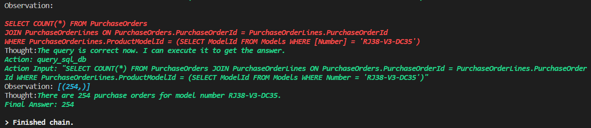

# oodle-chat
Uses Python, Langchain, OpenAI and PineconeDB to answer questions about Oodle.

Imagine if ChatGPT had context of your specific data and prioritized it while answering.
This project allows you to easily take some data that you have (like a Wiki, knowledge base or database), and allows you to query OpenAI with the context of your own data.

The chatwithDocs module answers questions based on documentation, and provides the answer plus a link to a demo video on the topic.

The queryDb module can translate natural language into SQL queries and then query a database for the answer.

## Inspired by

https://github.com/moshekarmel1/plop/
